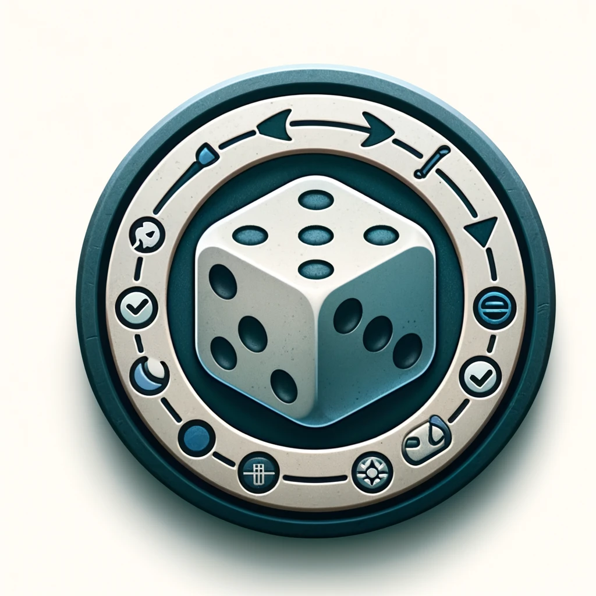

# fair



Fair is a simple virtual dice and a simple queue. It can be used for various purposes like duty rostering or just random arrowing of work. 

There is a turn system. Each turn only calls the name once. We cannot call a name twice within each turn. After every turn, the dice restart.

## 1. How to use
1. Write the list of names into `names_order.txt`. Alternatively, you can add them 
```
fair add <name>
```
e.g `fair add bryan`


## 2. Next, roll

2. 
```
fair roll
```

## 3. That's it. 
You can use git as a storage. 

```
git init
. dev/s.sh <commit-message>
```

## if you want to reset

> this will reset current turn. 
```
fair reset
```